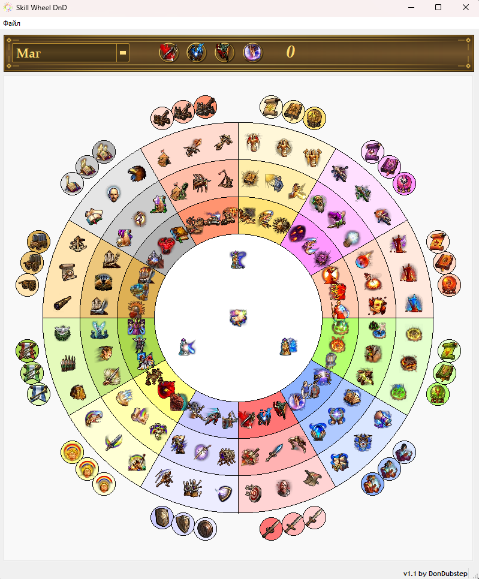
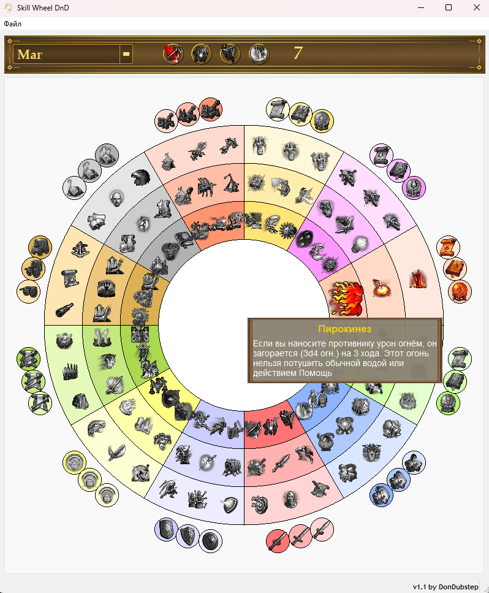
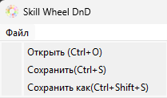

# Skill Wheel DnD

## Что это
Desktop приложение для удобной самостоятельной настройки навыков персонажей в Dungeons & Dragons (DnD), вдохновленное системой навыков из игры Heroes of Might and Magic 5 (HoMM5) и оригинальной программой Skill Wheel. Приложение позволяет визуально выбирать и комбинировать навыки в виде колеса, учитывая зависимости и ограничения по очкам навыков.

## Скриншоты
### Исходное состояние  

### Выбор скилла из сектора и наведение на неактивный скилл

## Установка и запуск

В папке `Skill_Wheel_app/` находится собранное приложение для Windows с необходимыми библиотеками Qt. Просто запустите `Skill_Wheel_app.exe`.

## Как использовать

1. Запустите приложение.
2. Выберите класс персонажа из выпадающего списка в верхней части окна.
3. Наведите курсор на иконку навыка для просмотра описания.
4. Кликните на иконку, чтобы выбрать/отменить выбор навыка.
5. Счетчик очков в заголовке показывает затраченные очки.
6. Зависимые навыки автоматически активируются/деактивируются.
7. При нажатии наведении на скилл и нажатии на английскую **"T"** описание скилла фиксируется

## Как сохранять и открывать пресеты
Для сохранения выбранной конфигурации нажмите `Ctrl+Shift+S` и выберите имя и расположения сохранённого файла расширения `.json`. Или можете сохранить комбинацией `Ctrl+S`, чтобы сделать сохранение под сгенерированным именем `saveX.json`, где **X** - номер сохранения.  
Открывать сохраненные пресеты можно комбинацией Ctrl+O и выбором соответствующего сохранения. Сохранения в таком случае будут храниться по пути `/папка_с_программой/src/saves/`  
Всем комбинациям клавиш `Ctrl+Shift+S`, `Ctrl+S`, `Ctrl+O` соответствуют кнопки, которые можно увидеть после нажатия на кнопку `"Файл"` в верхнем левом углу:

## Как модифицировать
Модифицировать программу можно с помощью файла `data.json` в папке src. В полях **"title"** можно изменять название скилла, в поле **"description"** – описание, в **"icon_path"** – иконку скилла, в **"depends"** – логику зависимостей скилла. В поле **"dependencies"** перечисляются скиллы, которые необходимо выбрать для активации текущего скилла. Перечислять скиллы в этом поле возможно через символы & и | для связи по И и ИЛИ. Например запись **"dependencies"**: "4 & 5" означает, что скиллу для активации необходимы скиллы 4 и 5, а запись "4 | 5" означает, что для активации скилла требуется активировать хотя бы 4 или 5 скилл.

Не рекоммендуется изменять индекс скилла в поле **"index"**, однако если уж очень хочется, то важно сделать индекс уникальным в отличие от остальных скиллов. Также не рекомендуется изменять названия кругов, секторов и категорий скиллов, так как это гарантировано приведёт к вылету программы на запуске😁

## Правила зависимостей скиллов
### Есть несколько категорий скиллов:
- Основные - находятся сверху в заголовке
- Классовые - находятся в центре
- Скиллы базового круга - расположены на самом внешнем круге (в кружочках)
- Скиллы первого круга расположены на внешнем круге после базового
- Скиллы второго круга - расположены между третьим и первым кругом
- Скиллы третьего круга - расположены на самом близком к центру круге
- Навыки за отыгрыш - будут располагаться внизу (скоро будут)

### Правила
- Для активации любого скилла будет увеличиваться на 1 счётчик.
- Для активации любого скилла на странице требуется активация хотя бы одного основного скилла
- Основные скиллы активируются последовательно: нельзя активировать только 1-ый и 3-ий, не активировав 2-ой
- Для активации скилла 1, 2 и 3 кругов требуется активация одного скилла базового круга
- Нельзя активировать скиллы из более чем 5 различных секторов круга
- Некоторые классовые скиллы и скиллы 1, 2, 3 кругов имеют зависимости от других скиллов, что прописывается в файле `data.json`
- Выбор скиллов на одной странице не зависят от выбора скиллов на другой странице 

Все правила учтены в программе и действуют автоматически

## Roadmap

- [x] Отрисовка навыков на странице
- [x] Отрисовка фона
- [x] Подгрузка данных скиллов из json
- [x] Отрисовка хэдера
- [x] Отрисовка центральных и базовых скиллов
- [x] Логика активации скиллов на странице
- [x] Затемнение невыбранных скиллов и удаление недоступных
- [x] Зависимость по **И** и **ИЛИ**
- [x] Сохранение профилей персонажей
- [ ] Оптимизация
- [ ] Исправление issue #1
- [ ] Переключатель учета требований навыков
- [ ] Заполнение логики активации навыков согласно google doc
- [ ] Предупреждения при нарушении логики прокачки
- [ ] Навыки за отыгрыш в footer для каждого класса

