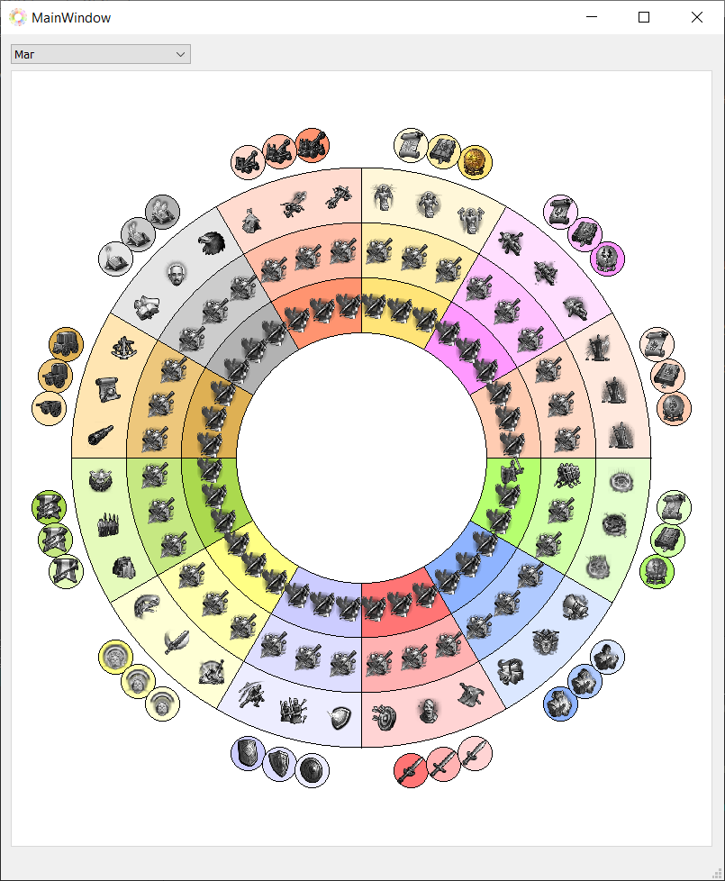
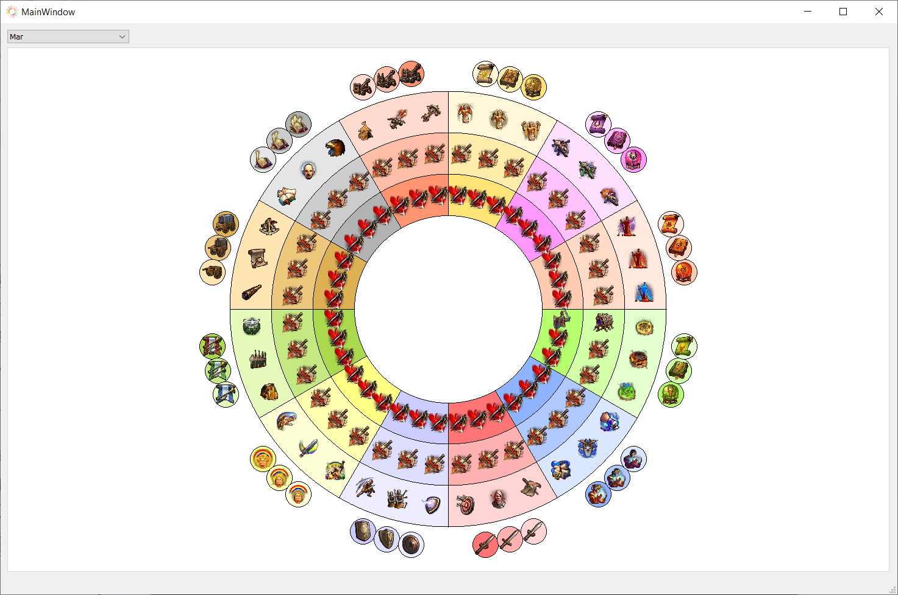

## Начата работа с иконками
Рамка с текстом теперь может растягиваться в зависимости от находящемся в ней текста

## Выглядит так

## Необходимо
1. Вычислять положение рамки относительно края окна

